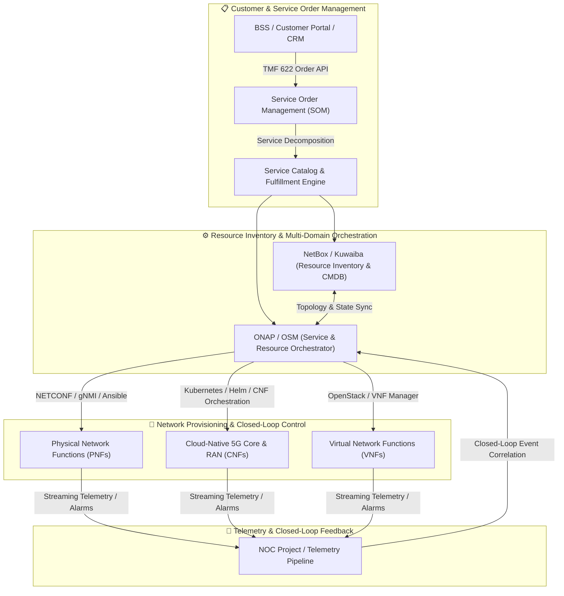

  

<<<<<<< HEAD
## Top Telecom OSS Platforms Ecosystem
**Curated List of SaaS Products & Open-Source GitHub Projects**
*Focused on Operations Support Systems — Inventory, Order Management, Fulfillment, Assurance, Orchestration, Service & Resource Management*
**Last updated: August 2026**

This repository tracks notable **SaaS platforms** and **open-source projects** for **Telecom OSS** (Operations Support Systems). These systems manage the operational lifecycle of telecom networks and services — including inventory, order fulfillment, service orchestration, fault/performance management, and resource activation — often in multi-vendor, multi-technology environments.

**Examples** include Netcracker, Amdocs, Nokia FlowOne, Oracle Communications, Openet, Etiya, Hansen Technologies, Optiva, CSG, and Enghouse Networks (the category leaders).

**Open-source emphasis**: Full commercial-grade OSS suites are uncommon in pure open source, but strong building blocks exist. **ONAP**, **OpenNMS**, **NetBox**, and related projects form the core of many operator and private-network open stacks. This section is heavily expanded with practical open alternatives.

Contributions welcome! Open a PR to add/update entries. Keep descriptions factual and link to official sites.

## Table of Contents
- [SaaS/Hosted Platforms](#saas-products)
- [Open-Source GitHub Projects](#open-source-github-projects)
- [How to Contribute](#how-to-contribute)
- [Disclaimer](#disclaimer)

## SaaS/Hosted Platforms
- **[Netcracker](https://www.netcracker.com/)**  
  Comprehensive OSS/BSS platform widely used by large carriers for service orchestration, inventory, fulfillment, and digital transformation programs.

- **[Amdocs](https://www.amdocs.com/)**  
  Major OSS/BSS suite provider offering modular solutions for catalog, order management, inventory, fulfillment, and related operational processes.

- **[Nokia FlowOne / Nokia OSS](https://www.nokia.com/)**  
  Network-centric OSS and service orchestration capabilities from Nokia, supporting multi-domain automation and assurance.

- **[Oracle Communications](https://www.oracle.com/industries/communications/)**  
  Broad portfolio of OSS/BSS and network automation solutions used by communications service providers.

- **[Openet](https://www.openet.com/)**  
  Specialist in charging, policy, and related real-time OSS/BSS components, often deployed in digital and 5G environments.

- **[Etiya](https://www.etiya.com/)**  
  Customer and product-centric BSS/OSS platform with catalog, order, and experience management capabilities.

- **[Hansen Technologies](https://www.hansencx.com/)**  
  Billing, customer care, and operational systems serving utilities and communications providers.

- **[Optiva](https://www.optiva.com/)**  
  Cloud-native BSS platform focused on charging, billing, and monetization for digital telcos and MVNOs (with OSS-adjacent capabilities).

- **[CSG](https://www.csgi.com/)**  
  Long-standing provider of BSS and operational systems for communications service providers, with strong North American presence.

- **[Enghouse Networks](https://www.enghouse.com/)**  
  Network and service management solutions covering OSS functions for operators and service providers.

## Open-Source GitHub Projects
- **[ONAP (Open Network Automation Platform)](https://github.com/onap)**  
  The leading open-source platform for designing, orchestrating, and managing VNFs, SDNs, and higher-level services — a cornerstone of open telecom automation and OSS-style orchestration.

- **[OpenNMS](https://github.com/OpenNMS/opennms)**  
  Enterprise-grade open-source network management platform providing fault, performance, and traffic monitoring that serves as a foundational OSS assurance component.

- **[NetBox](https://github.com/netbox-community/netbox)**  
  Popular open-source source-of-truth for network inventory, IPAM, and DCIM — frequently used as the inventory foundation in modern OSS stacks.

- **[Boda Telecom Suite (BTS-CE)](https://github.com/bodastage/bts-ce)**  
  Open-source, vendor- and technology-agnostic telecommunication network management platform with topology, CM browsing, RAN audit, and reporting features.

- **[OSM (Open Source MANO)](https://osm.etsi.org/)**  
  ETSI-aligned open-source Management and Orchestration platform for NFV, widely used in operator and research environments.

- **[LibreNMS](https://github.com/librenms/librenms)**  
  Open-source network monitoring system providing discovery, performance data, and alerting that feeds OSS assurance processes.

- **[free5GC / Open5GS and related cores](https://github.com/)**  
  Open 5G/4G core network projects whose management and monitoring components integrate into broader OSS-style operational stacks.

- **[Nephio](https://github.com/nephio-project/nephio)**  
  Kubernetes-based automation project focused on intent-driven orchestration for cloud-native telecom infrastructure.

- **[Ostelco and cloud-native BSS/OSS experiments](https://github.com/ostelco/ostelco-core)**  
  Open projects exploring cloud-native OCS/BSS patterns that can complement OSS fulfillment and charging flows.

- **[Telecom inventory parsers and CM tools](https://github.com/)**  
  Community tools for ingesting vendor configuration data, building topology, and supporting configuration management use cases.

### Additional Strong Open-Source Options
- Prometheus + Grafana + Alertmanager for metrics and basic closed-loop signals.
- Apache Kafka / Flink pipelines for event-driven order and inventory flows.
- TM Forum Open API inspired open implementations and reference code.
- Ansible / Terraform / Crossplane for infrastructure and service activation.
- Custom service catalog and order management prototypes built on open workflow engines (Camunda, Temporal, etc.).

**Frameworks for building custom systems**: Combine **NetBox** (inventory) + **ONAP** or **OSM** (orchestration) + **OpenNMS**/LibreNMS (assurance) + open workflow and messaging layers. For private or smaller networks, lighter stacks using NetBox, Prometheus, and automation tools often suffice. These approaches give full control and avoid proprietary lock-in, but require significant integration effort and lack the pre-built multi-vendor adapters, carrier-grade support, and end-to-end process maturity of commercial OSS suites.

## How to Contribute
1. Fork the repo.
2. Add/edit entries in `README.md` (follow existing format).
3. Include: name, link, 1–2 sentence description, and whether it's SaaS or open-source.
4. Submit PR with a short explanation.

Star the repo if you find it useful!

## Disclaimer
- This is a **community-curated** list — not exhaustive and not an endorsement.
- Telecom OSS systems sit at the heart of network and service operations. Open-source components offer transparency and flexibility but still demand careful architecture, testing, multi-vendor integration, and operational processes to meet carrier reliability and scale expectations.
- Always validate orchestration and activation logic thoroughly before impacting production networks.

---
**Made for network operators, OSS architects, and private-network teams seeking open operational foundations.**
Let's make telecom operations more modular, interoperable, and community-driven.
=======
# Awesome Telecom OSS 📡⚙️

  
  
  
  
  

---

## 🌐 Top Telecom Operations Support Systems (OSS) Ecosystem

**Curated List of Commercial SaaS Platforms & Open-Source GitHub Projects** 🚀  
*Focused on Telecom Operations Support Systems (OSS), Network Resource Inventory, Service Fulfillment, Multi-Domain Orchestration, Fault Management & Autonomous Network Automation* 📱🏢

---

### 💡 Overview & Scope

This repository tracks notable **commercial SaaS platforms** and **open-source projects** for **Telecom Operations Support Systems (OSS)**. These systems manage the end-to-end network lifecycle — inventory, discovery, service fulfillment, provisioning, assurance, orchestration, and closed-loop automation — across traditional RAN, transport, 5G Core (5GC), NFV, SDN, and multi-cloud environments.

- 🏆 **Enterprise Leaders**: Huawei, Oracle Communications, Ericsson, Nokia, ServiceNow, Amdocs, Netcracker, CSG, Comarch, Intracom Telecom, Etiya, and Optiva.
- 🔓 **Open-Source Stacks**: Open Network Automation Platform (ONAP), Open Source MANO (OSM), NetBox, Ansible, Kuwaiba CMDB, NOC Project, CGRateS, and Osmocom cellular components.

Contributions are welcome! Open a Pull Request to add or update entries. 🤝

---

## 📑 Table of Contents

- [🏢 SaaS/Hosted Platforms](#-saashosted-platforms)
- [🔓 Open-Source GitHub Projects](#-open-source-github-projects)
- [🏗️ Architectural Blueprint & Stacks](#%EF%B8%8F-architectural-blueprint--stacks)
- [🤝 How to Contribute](#-how-to-contribute)
- [⚠️ Disclaimer](#%EF%B8%8F-disclaimer)
- [📈 Star History](#-star-history)

---

## 🏢 SaaS/Hosted Platforms

*Sorted by company scale (Annual Revenue / Valuation descending)* 📊

| Product | Focus & Core Capabilities | Company Scale (Revenue / Valuation) | Starting Pricing Tier | Free Tier / Free Trial Limits |
| :--- | :--- | :--- | :--- | :--- |
| **[Huawei Cloud OSS / ADN](https://www.huawei.com/)** 🌐 | Multi-domain autonomous driving network (ADN) orchestration, iMaster NCE/MAE network automation, unified inventory, and carrier network slicing. | **~$100B+ Revenue** *(Global ICT & Telecom Leader)* | Starting at **~$4,500/month** (~$54,000/year) for base iMaster cloud-managed network controller and OSS automation package. | **30-day sandbox trial** with up to 5 virtual network nodes and simulated telecom telemetry datasets. |
| **[Oracle Communications OSS](https://www.oracle.com/communications/)** 🔴 | Unified Inventory Management (UIM), Service and Network Orchestration (SNO), and automated order-to-activate workflows across hybrid telco clouds. | **~$53.0B Revenue** *(~$400B+ Market Cap, NYSE: ORCL)* | Starting at **~$3,500/month** (~$42,000/year) base license for Oracle Communications UIM / Orchestrator on Oracle Cloud Infrastructure (OCI). | **30-day free trial** with $300 cloud credits on OCI + access to pre-configured Oracle Communications sandbox instances. |
| **[Ericsson OSS / Orchestrator](https://www.ericsson.com/)** 📶 | Multi-vendor service orchestration (Ericsson Orchestrator), automated network discovery, configuration management, and cloud RAN lifecycle management. | **~$25.0B Revenue** *(~$20B Market Cap, NASDAQ: ERIC)* | Starting at **~$4,000/month** (~$48,000/year) base subscription tier for Ericsson Dynamic Network Administration / Cloud Core orchestration module. | **30-day guided Proof of Concept (PoC)** sandbox environment with sample 5G Core/RAN network models and topology traces. |
| **[Nokia NetAct & AVA](https://www.nokia.com/)** 🔷 | Carrier-grade radio, core, and transport network management, automated configuration audits, fault correlation, and AI-driven closed-loop operations. | **~€19.9B ($21.5B) Revenue** *(~$25B Market Cap, NYSE: NOK)* | Starting at **~$3,000/month** (~$36,000/year) base subscription for Nokia NetAct Cloud / AVA Operations automation engine. | **30-day enterprise evaluation trial** supporting up to 50 simulated network elements and automated alarm correlation workflows. |
| **[ServiceNow Telecom Operations](https://www.servicenow.com/)** ⚡ | Telco Network Operations (TNO), Telecommunications Service Management (TSM), eTOM/TM Forum-aligned customer-to-network incident resolution, and inventory sync. | **~$10.0B Revenue** *(~$180B Market Cap, NYSE: NOW)* | Starting at **~$100/user/month** (~$1,200/user/year) or **~$5,000/month** minimum base instance package for TSM/TNO enterprise fulfillers. | **14-day free personal developer instance (PDI)** with full access to Telecom Service Management data models and workflow builder. |
| **[Amdocs Digital OSS](https://www.amdocs.com/)** 💼 | Catalog-driven service fulfillment, dynamic network inventory, NFV/SDN orchestration, and real-time end-to-end zero-touch operations. | **~$4.53B Revenue** *(~$10.5B Market Cap, NASDAQ: DOX)* | Starting at **~$4,200/month** (~$50,400/year) for entry catalog & service fulfillment base module. | **30-day interactive PoC / sandbox environment** with pre-loaded service catalogs, topology discovery, and order activation flows. |
| **[Netcracker Digital OSS](https://www.netcracker.com/)** 🌍 | Hybrid network orchestration, dynamic resource inventory, service order management, and multi-cloud telecom operations for Tier-1/2 operators. | **~$1.2B Revenue** *(Subsidiary of NEC - $25B+)* | Starting at **~$3,800/month** (~$45,600/year) for core resource inventory and service fulfillment software package. | **30-day cloud demo / guided PoC** on AWS/Azure with pre-built catalog-to-provisioning templates for 5G network slices. |
| **[CSG Network Solutions](https://www.csgi.com/)** 💳 | Telecommunication workforce management, automated dispatch, field operations optimization, and service activation orchestration. | **~$1.17B Revenue** *(~$1.5B Market Cap, NASDAQ: CSGS)* | Starting at **~$45/field-tech/month** (~$540/year per technician) or **~$1,800/month** minimum base platform license for Field Service Management. | **14-day guided sandbox pilot** with up to 10 simulated field technicians, dispatch routing, and work order tracking. |
| **[Comarch OSS](https://www.comarch.com/)** 🏛️ | Integrated network inventory, service fulfillment, network auto-discovery, physical/logical resource management, and fault management. | **~$450M Revenue** *(Global Enterprise Telco Provider)* | Starting at **~$2,200/month** (~$26,400/year) entry tier for Comarch Next Generation Network Planning and Inventory SaaS module. | **30-day cloud sandbox trial** with sample telecommunication transport topology, cross-connect routing, and circuit visualizer. |
| **[Intracom Telecom OSS](https://www.intracom-telecom.com/)** 📡 | Wireless transport network management, multi-layer service provisioning, unified inventory, and SLA threshold monitoring. | **~$250M Revenue** *(Global Telecom Systems Vendor)* | Starting at **~$1,500/month** (~$18,000/year) for entry WiBAS / uniMS network management system base license. | **30-day evaluation license** supporting up to 20 network radio nodes with full configuration and alarm tracking tools. |
| **[Etiya Digital OSS](https://www.etiya.com/)** 🤖 | AI-powered service order management, dynamic product catalog, inventory reconciliation, and automated service fulfillment workflows. | **~$120M Revenue** *(AI-Driven Telco Provider)* | Starting at **~$1,800/month** (~$21,600/year) entry subscription for digital service order orchestration and inventory connector. | **14-day interactive cloud trial** with sample eTOM process flows and multi-vendor API integration endpoints. |
| **[Optiva Operations Cloud](https://www.optiva.com/)** ☁️ | Cloud-native telecom operations, real-time subscriber and service provisioning, Kubernetes-managed charging/service mediation for MVNOs and CSPs. | **~$50M Revenue** *(Public: TSX: OPT)* | Starting at **~$2,000/month** (~$24,000/year) base subscription for Optiva cloud provisioning and mediation platform. | **30-day free PoC on Google Cloud Platform (GCP)** with sample subscriber provisioning traffic up to 10,000 active sessions. |

---

## 🔓 Open-Source GitHub Projects

*Sorted by GitHub Star Count descending* ⭐

- **[Ansible](https://github.com/ansible/ansible)**  📜  
  A radically simple IT automation platform for multi-vendor network device configuration, zero-touch provisioning (ZTP), and infrastructure orchestration via SSH/gNMI/NETCONF.

- **[NetBox](https://github.com/netbox-community/netbox)**  📦  
  The premier open-source Infrastructure Source of Truth (IPAM & DCIM) empowering telecom network automation, device modeling, cable/circuit tracing, and VRF management.

- **[ONAP (Open Network Automation Platform)](https://github.com/onap/clamp)**  🚀  
  Linux Foundation carrier-grade platform for real-time, policy-driven orchestration and automation of physical, virtual, and cloud-native network functions (VNFs/CNFs).

- **[CGRateS](https://github.com/cgrates/cgrates)**  🎯  
  High-performance real-time rating, mediation, LCR routing, and CDR processing engine designed to seamlessly integrate with telecom softswitches and OSS billing systems.

- **[NOC Project](https://github.com/getnoc/noc)**  🛠️  
  Scalable, high-performance open-source Network Operations Support System (NMS/OSS) providing multi-vendor network discovery, fault management, configuration backup, and inventory.

- **[Osmocom](https://github.com/osmocom/osmo-bsc)**  📱  
  Extensive modular suite of open-source cellular infrastructure software covering BSC, MSC, HLR, SGSN, and GGSN protocols for mobile telecom networks.

- **[Kuwaiba](https://github.com/kuwaiba/kuwaiba)**  🌲  
  Carrier-grade enterprise open-source network inventory system (NIS) and CMDB specialized for telecom, fiber/GPON physical layer modeling, and logical service topology.

- **[Open5GS](https://github.com/open5gs/open5gs)**  📶  
  C-language open-source 5G Core (5GC) and 4G EPC network supporting Prometheus metric exposition, SBI trace logging, and service-based architecture management.

- **[free5GC](https://github.com/free5gc/free5gc)**  🧪  
  Open-source 3GPP Release 15/16-compliant 5G mobile core network in Golang, providing SBI transaction logs, protocol trace capture, and service introspection for OSS testing.

- **[telecom-provision-engine](https://github.com/kambidi1973/telecom-provision-engine)**  ⚙️  
  Microservices-based open-source telecom OSS/BSS provisioning and order management engine with modular inventory and activation connectors.

---

## 🏗️ Architectural Blueprint & Stacks

- **Service & Resource Orchestration**: Combine **ONAP** or **Open Source MANO (OSM)** for standards-aligned (ETSI NFV / 3GPP) network service lifecycle management.
- **Single Source of Truth**: Use **NetBox** or **Kuwaiba** to track physical infrastructure, rack elevations, fiber cables, circuits, and IP allocations.
- **Automated Configuration & ZTP**: Deploy **Ansible** playbooks with gNMI/NETCONF modules for idempotent configuration push and firmware rollouts.
- **Closed-Loop Assurance Integration**: Stream alarms and telemetry back to **NOC Project** or correlation engines to trigger auto-remediation workflows.

---

## 🤝 How to Contribute

1. 🍴 **Fork the repo** on GitHub.
2. 🌿 **Create a feature branch**: `git checkout -b feature/new-oss-tool`.
3. 📝 **Add/edit entries in `README.md`**: Follow the established table or badge structure, maintaining sorted order where applicable.
4. 💡 **Ensure factual descriptions**: Include verifiable starting pricing tiers, specific free trial / free tier limits, or official GitHub links.
5. 🚀 **Submit a Pull Request (PR)** with a clear description of your contribution.

⭐ **Star the repo** if you find it helpful for your telecom network engineering and operations workflows!

---

## ⚠️ Disclaimer

- This repository is a **community-curated index** for informational and educational purposes.
- Telecom OSS platforms handle mission-critical network provisioning, routing, and operational control. Always validate orchestration templates and automated scripts in non-production lab environments before deploying to live production networks.
- Product names, logos, and brands are property of their respective owners.

---

## ⭐ Star History

<a href="https://www.star-history.com/?repos=ishandutta2007%2FAwesome-Telecom-OSS&type=date&legend=bottom-right">
<picture>
<source media="(prefers-color-scheme: dark)" srcset="https://api.star-history.com/chart?repos=ishandutta2007/Awesome-Telecom-OSS&type=date&theme=dark&legend=bottom-right" />
<source media="(prefers-color-scheme: light)" srcset="https://api.star-history.com/chart?repos=ishandutta2007/Awesome-Telecom-OSS&type=date&legend=bottom-right" />

</picture>
</a>

---

  <b>Built with ❤️ for telecom network architects, OSS engineers, SREs, and NOC operators worldwide.</b>

>>>>>>> 1796fae1977b508da5ab9b6e5bcfa5b6e640492e
