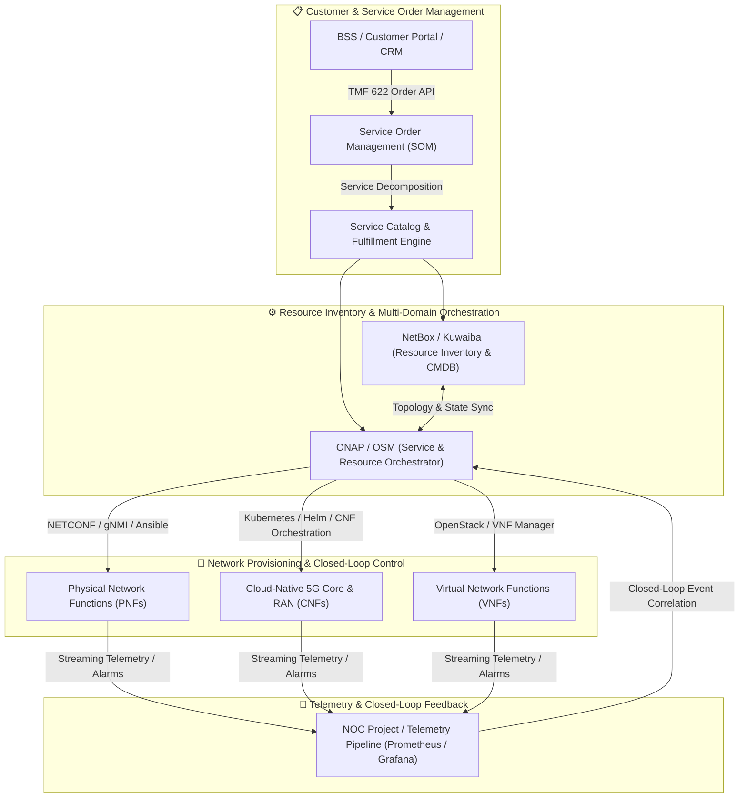

  

# Awesome Telecom OSS 📡⚙️⚡

  
  
  
  
  
  
  
  

---

## 🌐 Telecom Operations Support Systems (OSS) & Autonomous Networks Ecosystem

A curated, comprehensive catalog of **Enterprise SaaS Platforms**, **Carrier-Grade Software Suites**, and **Open-Source GitHub Projects** for **Telecom Operations Support Systems (OSS)**, **Network Resource Inventory (CMDB/IPAM)**, **Service Order Management & Fulfillment (SOM/COM)**, **Multi-Domain Service Orchestration (MANO/NFV/SDN)**, **Fault & Performance Management (NPMD/FM)**, **5G Core/RAN Slicing**, and **Closed-Loop AIOps Automation**. 🚀📱

These carrier-grade tools empower Communication Service Providers (CSPs), Mobile Network Operators (MNOs), Internet Service Providers (ISPs), Managed Service Providers (MSPs), and Private 5G enterprise operators to:
- 📊 **Manage Unified Network Inventory**: Maintain high-fidelity physical, logical, virtual, and cloud-native network topology and configuration state across multi-vendor fabrics.
- ⚡ **Automate Zero-Touch Provisioning (ZTP)**: Translate commercial product catalog orders into automated multi-layer network activation and configuration workflows via TM Forum Open APIs and NETCONF/gNMI.
- 🎯 **Orchestrate Hybrid Telco Clouds**: Automate the lifecycle management (LCM) of Physical Network Functions (PNFs), Virtual Network Functions (VNFs), and Cloud-Native Network Functions (CNFs) across edge and multi-cloud environments.
- 🛡️ **Enable Closed-Loop Assurance & Healing**: Detect telemetry anomalies, correlate alarms across OSI layers, suppress noise, and trigger automated self-healing and scaling policies.

---

## 📑 Table of Contents

- [🏢 SaaS & Hosted Commercial Platforms](#-saas--hosted-commercial-platforms)
- [🔓 Open-Source GitHub Projects](#-open-source-github-projects)
- [🏗️ Architectural Blueprint & Stacks](#%EF%B8%8F-architectural-blueprint--stacks)
- [🤝 How to Contribute](#-how-to-contribute)
- [⚠️ Disclaimer](#%EF%B8%8F-disclaimer)
- [Star History](#star-history)

---

## 🏢 SaaS & Hosted Commercial Platforms

*The table below is sorted descending by **Company Scale (Annual Revenue / Valuation)**.* 📊

| Product / Platform | Company Scale (Revenue / Valuation) | Focus & Core Capabilities | Starting Pricing Tier | Free Tier / Free Trial Limits |
| :--- | :--- | :--- | :--- | :--- |
| **[Huawei Cloud OSS / ADN](https://www.huawei.com/)** 🌐 | **~$100B+ Revenue** *(Global ICT & Telecom Infrastructure Leader)* | Multi-domain autonomous driving network (ADN) orchestration, iMaster NCE/MAE network automation, unified resource inventory, and 5G network slicing. | Starting at **~$4,500/month** (~$54,000/year) for base iMaster cloud-managed network controller and OSS automation package. | **30-day sandbox trial** with up to 5 virtual network nodes and simulated telecom telemetry datasets. |
| **[Oracle Communications OSS](https://www.oracle.com/communications/)** 🔴 | **~$53.0B Revenue** *(~$400B+ Market Cap, NYSE: ORCL)* | Unified Inventory Management (UIM), Service and Network Orchestration (SNO), and automated order-to-activate workflows across hybrid telco clouds. | Starting at **~$3,500/month** (~$42,000/year) base license for Oracle Communications UIM / Orchestrator on Oracle Cloud Infrastructure (OCI). | **30-day free trial** with $300 cloud credits on OCI + access to pre-configured Oracle Communications sandbox instances. |
| **[Ericsson OSS / Orchestrator](https://www.ericsson.com/)** 📶 | **~$25.0B Revenue** *(~$20B Market Cap, NASDAQ: ERIC)* | Multi-vendor service orchestration (Ericsson Orchestrator), automated network discovery, configuration management, and cloud RAN lifecycle management. | Starting at **~$4,000/month** (~$48,000/year) base subscription tier for Ericsson Dynamic Network Administration / Cloud Core orchestration module. | **30-day guided Proof of Concept (PoC)** sandbox environment with sample 5G Core/RAN network models and topology traces. |
| **[Nokia FlowOne & NetAct](https://www.nokia.com/)** 🔷 | **~€19.9B ($21.5B) Revenue** *(~$25B Market Cap, NYSE: NOK)* | Carrier-grade radio, core, and transport network management, automated configuration audits, fault correlation, and AI-driven closed-loop operations. | Starting at **~$3,000/month** (~$36,000/year) base subscription for Nokia FlowOne Cloud / AVA Operations automation engine. | **30-day enterprise evaluation trial** supporting up to 50 simulated network elements and automated alarm correlation workflows. |
| **[ServiceNow Telecom Operations](https://www.servicenow.com/)** ⚡ | **~$10.0B Revenue** *(~$180B Market Cap, NYSE: NOW)* | Telco Network Operations (TNO), Telecommunications Service Management (TSM), eTOM/TM Forum-aligned customer-to-network incident resolution, and inventory sync. | Starting at **~$100/user/month** (~$1,200/user/year) or **~$5,000/month** minimum base instance package for TSM/TNO enterprise fulfillers. | **14-day free personal developer instance (PDI)** with full access to Telecom Service Management data models and workflow builder. |
| **[Amdocs Digital OSS & Openet](https://www.amdocs.com/)** 💼 | **~$4.53B Revenue** *(~$10.5B Market Cap, NASDAQ: DOX)* | Catalog-driven service fulfillment, dynamic network inventory, NFV/SDN orchestration, and real-time end-to-end zero-touch operations. | Starting at **~$4,200/month** (~$50,400/year) for entry catalog & service fulfillment base module. | **30-day interactive PoC / sandbox environment** with pre-loaded service catalogs, topology discovery, and order activation flows. |
| **[Netcracker Digital OSS](https://www.netcracker.com/)** 🌍 | **~$1.2B Revenue** *(Subsidiary of NEC Corporation - $25B+)* | Hybrid network orchestration, dynamic resource inventory, service order management, and multi-cloud telecom operations for Tier-1/2 operators. | Starting at **~$3,800/month** (~$45,600/year) for core resource inventory and service fulfillment software package. | **30-day cloud demo / guided PoC** on AWS/Azure with pre-built catalog-to-provisioning templates for 5G network slices. |
| **[CSG Network Solutions](https://www.csgi.com/)** 💳 | **~$1.17B Revenue** *(~$1.5B Market Cap, NASDAQ: CSGS)* | Telecommunication workforce management, automated dispatch, field operations optimization, and service activation orchestration. | Starting at **~$45/field-tech/month** (~$540/year per technician) or **~$1,800/month** minimum base platform license for Field Service Management. | **14-day guided sandbox pilot** with up to 10 simulated field technicians, dispatch routing, and work order tracking. |
| **[Enghouse Networks](https://www.enghouse.com/)** 📡 | **~$480M Revenue** *(Public: TSX: ENGH)* | Multi-service network resource management, GIS-based fiber inventory, service provisioning, and network fault/performance diagnostics. | Starting at **~$2,500/month** (~$30,000/year) for Enghouse NetMan and Network Resource Management starter suite. | **30-day guided evaluation pilot** with sample fiber optic GIS mapping and circuit provisioning modules. |
| **[Comarch OSS](https://www.comarch.com/)** 🏛️ | **~$450M Revenue** *(Global Enterprise Telco Software Provider)* | Integrated network inventory, service fulfillment, network auto-discovery, physical/logical resource management, and fault management. | Starting at **~$2,200/month** (~$26,400/year) entry tier for Comarch Next Generation Network Planning and Inventory SaaS module. | **30-day cloud sandbox trial** with sample telecommunication transport topology, cross-connect routing, and circuit visualizer. |
| **[Hansen Technologies](https://www.hansencx.com/)** ⚡ | **~$220M Revenue** *(Public: ASX: HSN)* | Catalog-driven service fulfillment, automated product-to-network order delivery, and dynamic resource provisioning for CSPs. | Starting at **~$2,400/month** (~$28,800/year) for Hansen Create / Deliver automated catalog and service fulfillment software. | **14-day guided cloud demo** with pre-configured telco product-to-service mapping and order decomposition flows. |
| **[Intracom Telecom OSS](https://www.intracom-telecom.com/)** 📡 | **~$250M Revenue** *(Global Telecommunication Systems Vendor)* | Wireless transport network management, multi-layer service provisioning, unified inventory, and SLA threshold monitoring. | Starting at **~$1,500/month** (~$18,000/year) for entry WiBAS / uniMS network management system base license. | **30-day evaluation license** supporting up to 20 network radio nodes with full configuration and alarm tracking tools. |
| **[Etiya Digital OSS](https://www.etiya.com/)** 🤖 | **~$120M Revenue** *(AI-Driven Digital Telco Provider)* | AI-powered service order management, dynamic product catalog, inventory reconciliation, and automated service fulfillment workflows. | Starting at **~$1,800/month** (~$21,600/year) entry subscription for digital service order orchestration and inventory connector. | **14-day interactive cloud trial** with sample eTOM process flows and multi-vendor API integration endpoints. |
| **[Optiva Operations Cloud](https://www.optiva.com/)** ☁️ | **~$50M Revenue** *(Public: TSX: OPT)* | Cloud-native telecom operations, real-time subscriber and service provisioning, Kubernetes-managed charging/service mediation for MVNOs and CSPs. | Starting at **~$2,000/month** (~$24,000/year) base subscription for Optiva cloud provisioning and mediation platform. | **30-day free PoC on Google Cloud Platform (GCP)** with sample subscriber provisioning traffic up to 10,000 active sessions. |

---

## 🔓 Open-Source GitHub Projects

*The open-source projects below are sorted descending by **GitHub Star Counts**.* ⭐

- **[Grafana](https://github.com/grafana/grafana)**  📊  
  Industry-standard open observability, interactive telemetry visualization, metric alerting, and unified dashboard engine widely deployed in telecom NOCs and SOCs.

- **[Ansible](https://github.com/ansible/ansible)**  📜  
  Radically simple IT automation engine for multi-vendor network device configuration, zero-touch provisioning (ZTP), and infrastructure orchestration via SSH, NETCONF, and gNMI.

- **[Prometheus](https://github.com/prometheus/prometheus)**  🔥  
  Cloud Native Computing Foundation (CNCF) time-series monitoring, service discovery, and multidimensional metric alerting stack powering 5G cloud-native network functions (CNFs).

- **[NetBox](https://github.com/netbox-community/netbox)**  📦  
  The premier open-source Infrastructure Source of Truth (IPAM & DCIM) empowering telecom network automation, device modeling, cable/circuit tracing, and VRF management.

- **[Telegraf](https://github.com/influxdata/telegraf)**  ⏱️  
  Plugin-driven server agent for collecting and reporting metrics, supporting SNMP, gNMI/gRPC network management, NetFlow, sFlow, Kafka, and IPFIX streaming telemetry.

- **[ntopng](https://github.com/ntop/ntopng)**  🔍  
  High-speed, web-based network traffic analysis and flow monitoring probe capable of deep packet inspection (nDPI), SLA latency tracking, and throughput profiling.

- **[Zeek](https://github.com/zeek/zeek)**  🛡️  
  High-performance open network security monitoring and traffic analysis engine that transforms raw wire packets into structured, behavioral telemetry streams.

- **[Zabbix](https://github.com/zabbix/zabbix)**  📈  
  Enterprise-class open-source distributed monitoring solution designed for carrier networks, optical links, SNMP discovery, and real-time SLA threshold alerting.

- **[Suricata](https://github.com/suricata/suricata)**  🚨  
  Multi-threaded Network IDS, IPS, and network security monitoring engine capable of real-time packet inspection and anomaly detection at multi-gigabit carrier line rates.

- **[LibreNMS](https://github.com/librenms/librenms)**  🖥️  
  Autodiscovering PHP/MySQL-based network monitoring system supporting comprehensive SNMP polling, BGP/OSPF peering state tracking, optical transceiver levels, and alert rules.

- **[Open5GS](https://github.com/open5gs/open5gs)**  📶  
  C-language open-source 5G Core (5GC) and 4G EPC implementation with rich Prometheus metric instrumentation, Diameter/HTTP2 SBI tracing, and user plane diagnostics.

- **[FreeRADIUS](https://github.com/FreeRADIUS/freeradius-server)**  🔑  
  High-performance, modular RADIUS/AAA server used globally by ISPs and telcos for subscriber authentication, accounting, and policy enforcement.

- **[Kamailio](https://github.com/kamailio/kamailio)**  📞  
  Carrier-grade open-source SIP Server handling millions of call setups per hour, prepaid billing primitives, IMS core routing, and real-time charging integration.

- **[CGRateS](https://github.com/cgrates/cgrates)**  🎯  
  High-performance real-time rating, mediation, LCR routing, and CDR processing engine designed to seamlessly integrate with telecom softswitches and OSS billing systems.

- **[free5GC](https://github.com/free5gc/free5gc)**  🧪  
  Open-source 3GPP Release 15/16-compliant 5G mobile core network in Golang, providing SBI transaction logs, protocol trace capture, and service-based architecture introspection.

- **[OpenSIPS](https://github.com/OpenSIPS/opensips)**  ⚡  
  Multi-functional open-source SIP server providing Class 4/5 VoIP routing, CDR generation, traffic management, and real-time prepaid billing hooks.

- **[OpenNMS](https://github.com/OpenNMS/opennms)**  🌐  
  Enterprise-grade, carrier-scale open-source network management platform providing event correlation, active synthetic polling, flow analysis, and carrier fault/performance assurance.

- **[Cacti](https://github.com/Cacti/cacti)**  🌵  
  Robust, enterprise-proven RRDtool-based network graphing and time-series capacity monitoring solution used across ISPs and carrier transport networks.

- **[Nephio](https://github.com/nephio-project/nephio)**  ☁️  
  Linux Foundation & Google-backed Kubernetes-based intent-driven automation project for carrier-grade multi-vendor cloud-native telecom infrastructure orchestration.

- **[NOC Project](https://github.com/getnoc/noc)**  🛠️  
  Scalable, high-performance open-source Network Operations Support System (NMS/OSS) providing multi-vendor network discovery, fault management, configuration backup, and inventory.

- **[Kuwaiba](https://github.com/kuwaiba/kuwaiba)**  🌲  
  Carrier-grade enterprise open-source network inventory system (NIS) and CMDB specialized for telecom, fiber/GPON physical layer modeling, and logical service topology.

- **[Boda Telecom Suite (BTS-CE)](https://github.com/bodastage/bts-ce)**  📡  
  Open-source, vendor-agnostic telecommunication RAN configuration management (CM) parser, network topology browser, parameter audit, and radio baseline compliance tool.

- **[Osmocom](https://github.com/osmocom/osmo-bsc)**  📱  
  Extensive modular suite of open-source cellular infrastructure software covering BSC, MSC, HLR, SGSN, and GGSN protocols for mobile telecom networks.

- **[ONAP (Open Network Automation Platform)](https://github.com/onap/clamp)**  🚀  
  Linux Foundation carrier-grade platform for real-time, policy-driven orchestration and automation of physical, virtual, and cloud-native network functions (VNFs/CNFs).

- **[telecom-provision-engine](https://github.com/kambidi1973/telecom-provision-engine)**  ⚙️  
  Microservices-based open-source telecom OSS/BSS provisioning and order management engine with modular inventory and activation connectors.

---

## 🏗️ Architectural Blueprint & Stacks

### 🛠️ Building a Modular Next-Gen Telecom OSS Stack

- **Service & Resource Orchestration**: Combine **ONAP**, **Open Source MANO (OSM)**, or **Nephio** for standards-aligned (ETSI NFV / 3GPP / Kubernetes) network service lifecycle management.
- **Single Source of Truth**: Use **NetBox** or **Kuwaiba** to track physical infrastructure, rack elevations, fiber cables, circuits, and IP allocations.
- **Automated Configuration & ZTP**: Deploy **Ansible** playbooks with gNMI/NETCONF modules for idempotent configuration push and firmware rollouts.
- **Closed-Loop Assurance Integration**: Stream alarms and telemetry back to **NOC Project** or correlation engines to trigger auto-remediation workflows.

---

## 🤝 How to Contribute

1. 🍴 **Fork the repo** on GitHub.
2. 🌿 **Create a feature branch**: `git checkout -b feature/new-oss-tool`.
3. 📝 **Add/edit entries in `README.md`**: Follow the established table or badge structure, maintaining sorted order where applicable.
4. 💡 **Ensure factual descriptions**: Include verifiable starting pricing tiers, specific free trial / free tier limits, or official GitHub links.
5. 🚀 **Submit a Pull Request (PR)** with a clear description of your contribution.

⭐ **Star the repo** if you find it helpful for your telecom network engineering and operations workflows!

---

## ⚠️ Disclaimer

- This repository is a **community-curated index** for informational and educational purposes.
- Telecom OSS platforms handle mission-critical network provisioning, routing, and operational control. Always validate orchestration templates and automated scripts in non-production lab environments before deploying to live production networks.
- Product names, logos, and brands are property of their respective owners.

---

##  Star History

---

  <b>Built with ❤️ for telecom network architects, OSS engineers, SREs, and NOC operators worldwide.</b>

